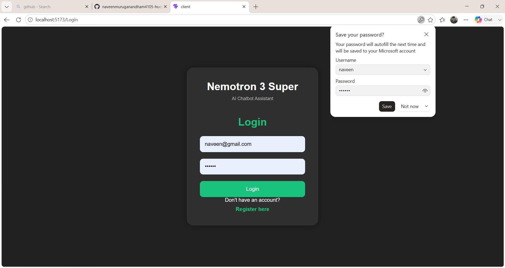
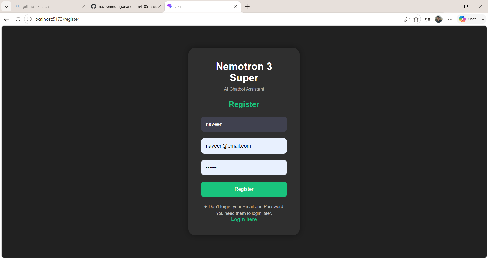
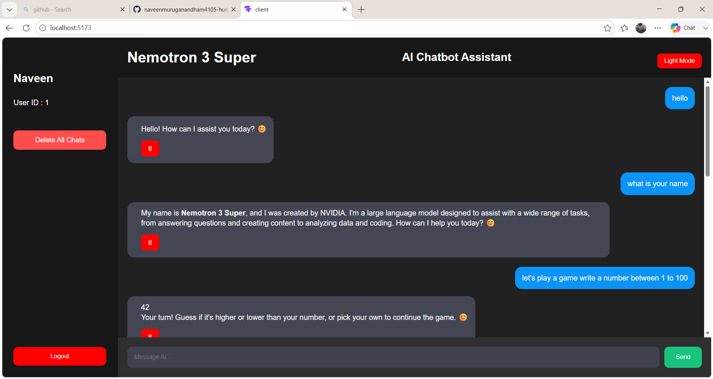
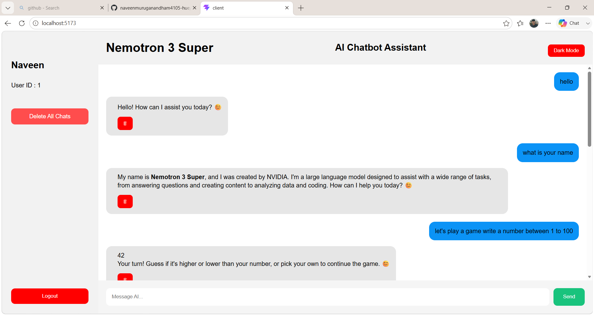
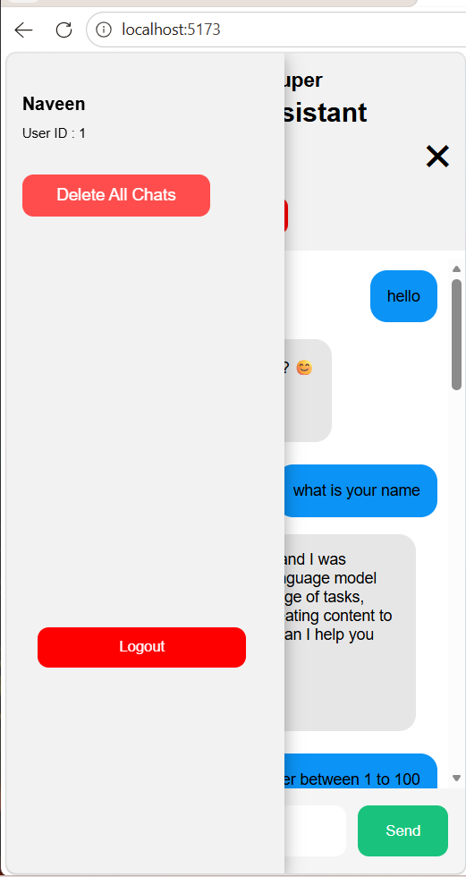
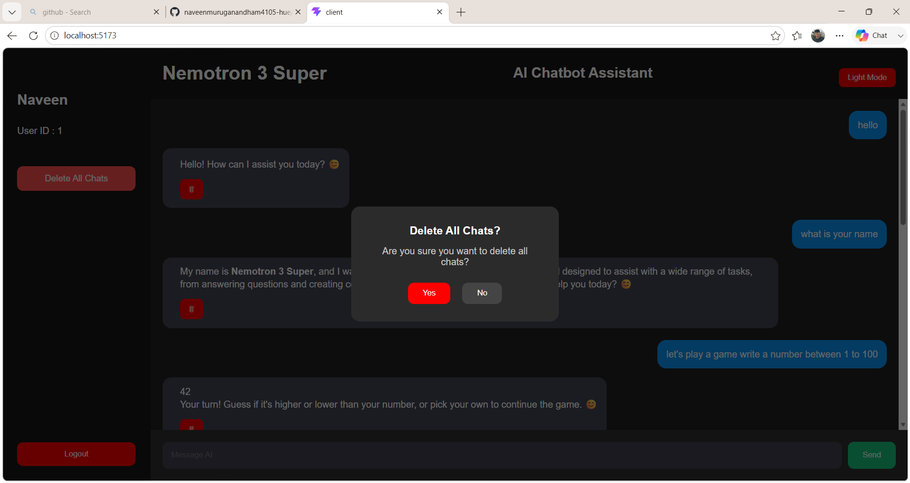

# 🤖 Nemotron 3 Super AI Chatbot Assistant

Nemotron 3 Super AI Chatbot Assistant is a full-stack AI-powered chatbot application developed using **React, Node.js, Express, MySQL, and OpenRouter API**. The project provides an intelligent conversational experience with secure authentication and chat history management.

## 🚀 Features

* 🔐 User Registration and Login Authentication
* 🤖 AI Chat powered by OpenRouter API
* 💬 Store and Retrieve Chat History
* 🗑 Delete Individual Messages
* 🧹 Delete All Chats
* 🌙 Dark Mode Support
* 📱 Responsive User Interface
* 🔒 JWT Authentication
* 👤 User Profile Section

## 🛠 Tech Stack

### Frontend

* React.js
* React Router DOM
* Axios
* CSS3
* Vite

### Backend

* Node.js
* Express.js
* JWT Authentication
* bcryptjs
* dotenv

### Database

* MySQL

### AI Model

* OpenRouter API
* Nemotron Models

## 📂 Project Structure

```
Nemotron-3-Super-AI-Chatbot-Assistant
│
├── client
│
├── server
│
└── README.md
```

## ⚡ Installation

### Clone Repository

```bash
git clone https://github.com/naveenmuruganandham4105-hue/Nemotron-3-Super-AI-Chatbot-Assistant.git
```

### Frontend Setup

```bash
cd client
npm install
npm run dev
```

### Backend Setup

```bash
cd server
npm install
npm start
```

# 📸 Screenshots

## Login Page
<p align="center">
  
</p>

## Register Page
<p align="center">
  
</p>

## Chatbot UI (Dark Mode)
<p align="center">
  
</p>

## Chatbot UI (Light Mode)
<p align="center">
  
</p>

## Mobile View
<p align="center">
  
</p>

## Delete All Chats Feature
<p align="center">
  
</p>

## 👥 Team Members

This project was developed as a **3-member group project**.

* **Naveen M**
* **XXXXXX**
* **XXXXXX**

## 👨‍💻 My Contribution

As part of this project, my responsibilities included:

* Developing the chatbot frontend using **React.js**
* Designing and styling the user interface using **CSS**
* Creating responsive layouts for desktop and mobile devices
* Managing and integrating the **MySQL database**

## 🔮 Future Improvements

* Voice Input Support
* Speech Output
* Multiple AI Models
* Export Chat as PDF
* Cloud Database Integration

---

**Developed with ❤️ using React, Node.js, Express, MySQL, and OpenRouter API.**
